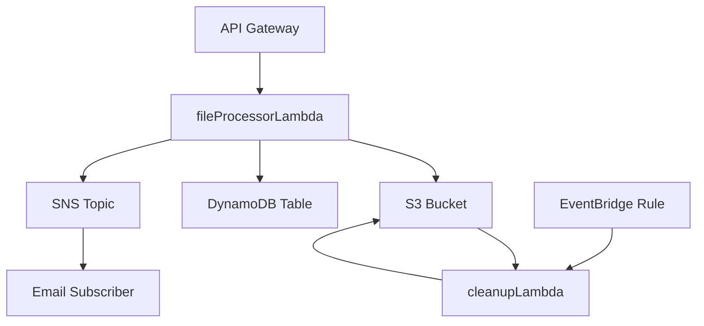

# Regular Exam Stack: File Upload Service

This repository provides an AWS CDK project to deploy a file upload service. The stack includes an S3 bucket for file storage, a DynamoDB table for metadata, an SNS topic for notifications, and Lambda functions for file processing and cleanup. Additionally, an API Gateway provides an endpoint for uploading files.

---

## Architecture Overview

### Components

1. **S3 Bucket**
   - Stores uploaded files.
   - Sends notifications to a Lambda function when new files are uploaded.

2. **DynamoDB Table**
   - Stores metadata about uploaded files such as file extension and upload date.
   - Table schema:
     - `FileExtension` (Partition Key)
     - `UploadDate` (Sort Key)

3. **SNS Topic**
   - Notifies subscribers when a new file is uploaded.
   - Subscription example:
     - Email notification to `velmira.cacc@gmail.com`.

4. **Lambda Functions**
   - `fileProcessorLambda`: Processes uploaded files, stores metadata in DynamoDB, and sends SNS notifications.
   - `cleanupLambda`: Deletes files older than 30 minutes from the S3 bucket.

5. **API Gateway**
   - Provides an HTTP POST endpoint for file uploads.
   - Directly triggers the `fileProcessorLambda` function.

6. **EventBridge Rule**
   - Triggers the `cleanupLambda` function every 30 minutes to remove old files.

---

## Deployment

### Prerequisites

1. **AWS CLI**: Ensure you have the AWS CLI installed and configured.
2. **Node.js**: Install Node.js (v16 or later is recommended).
3. **AWS CDK**: Install the AWS CDK CLI:
   ```bash
   npm install -g aws-cdk
   ```

### Steps to Deploy

1. **Install Dependencies**
   - Navigate to the project directory and install required packages:
     ```bash
     npm install
     ```

2. **Bootstrap CDK (if not already done)**
   - Run the following command to bootstrap the environment:
     ```bash
     cdk bootstrap
     ```

3. **Deploy the Stack**
   - Deploy the stack to AWS:
     ```bash
     cdk deploy
     ```

4. **Outputs**
   - After deployment, note the following outputs:
     - **APIEndpoint**: The API Gateway endpoint for uploading files.
     - **S3BucketName**: The name of the S3 bucket for file storage.

---

## Usage

### Upload a File

1. Send a POST request to the `APIEndpoint` (retrieved from the deployment output).
2. The request body should contain the file content as a Base64-encoded string.

Example Request:
```bash
curl -X POST <APIEndpoint>/upload \
-H "Content-Type: application/json" \
-d '{
  "file": "<Base64-Encoded-File-Content>"
}'
```

### Email Notification
- After a successful file upload, an email notification is sent via the SNS topic to the subscribed email address.

---

## Cleanup

- Files older than 30 minutes are automatically deleted from the S3 bucket by the `cleanupLambda` function, triggered every 30 minutes by EventBridge.

---

## Testing

### Unit Tests
- **Install Jest**: Ensure Jest is installed in your development environment.
  ```bash
  npm install --save-dev jest @types/jest
  ```
- **Run Tests**:
  ```bash
  npm test
  ```

### Example Test Case (for Lambda Function)
Add the following Jest test for the `fileProcessorLambda`:
```javascript
import { handler } from '../src/fileProcessorLambda';

describe('fileProcessorLambda', () => {
  it('should process a valid file upload request', async () => {
    const event = {
      body: '<Base64-Encoded-File>',
    };

    const result = await handler(event);
    expect(result.statusCode).toBe(200);
    expect(JSON.parse(result.body).message).toBe('File uploaded successfully!');
  });
});
```

---

## Diagram



---

